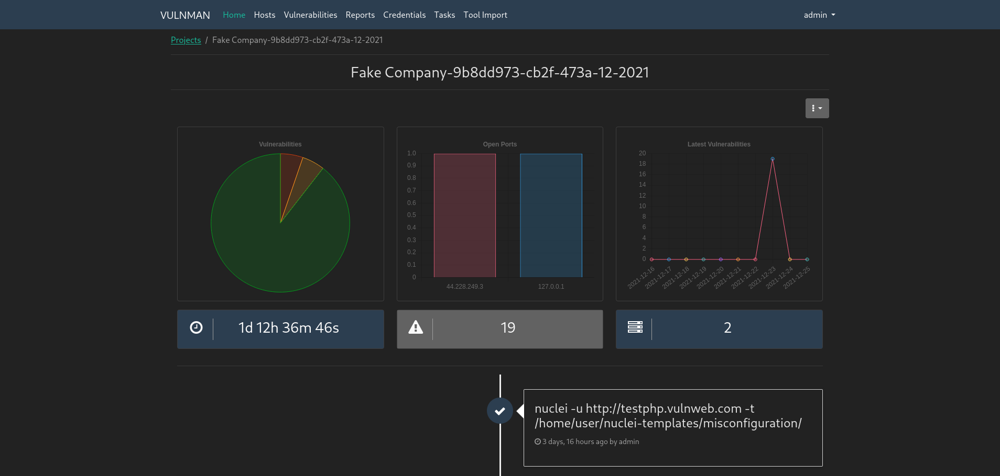

# Vulnman Documentation

Vulnman is a penetration test and vulnerability management application.

It provides a web interface to create pentesting projects, manage the associated hosts, services and applications, 
vulnerabilities and reports.

The generated reports are served as PDF files.

!!! warning
    This project is in a very early stage. You may not want to use it in production.
    The Web-UI will be polished once a backend functionality is more stable and complete.

## Getting Started

1. [Glossary](getting_started/glossary.md)
2. [Features](getting_started/features.md)
3. [Installation](getting_started/installation/server.md)

## Source Code
All source code is available on [Github](https://github.com/vulnman).