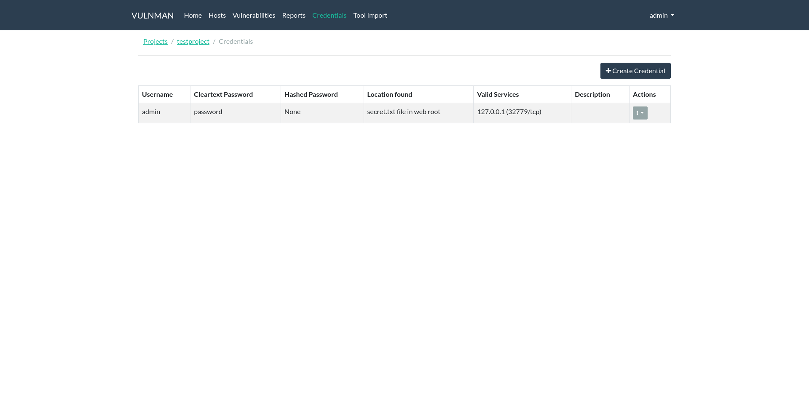

==============
Vulnman Server
==============

This section will give a quick usage overview of the vulnman server.

Web Interface
=============

Dashboard
*********

Every project has a simple dashboard page.
This page shows the project name, customer and some charts about your assessments progress.

.. figure:: ../../../assets/webui/dashboard.png
  :width: 800
  :alt: Dashboard

  Simple project dashboard

Credentials
***********
You can manage credentials found during an assessment from within the web interface

    Credentials view using the ``flatly`` theme
