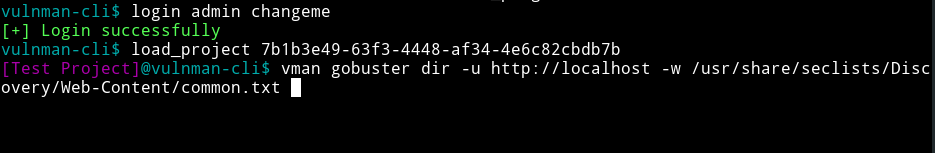

# CLI - Usage

If you are into the vulnman-cli, you first want to log into your server, by entering the following command.

```bash
login <username> <password>
```

You can specify an optional server using the ``--server`` flag.


Load a project using the following command.

```bash
load_project <project_id>
```

At the current state, you must get the uuid from the [REST-API](../../advanced/rest_api.md) or the [project dashboard]().

All commands that you are prefixing with `vman` are processed by the vulnman server.


