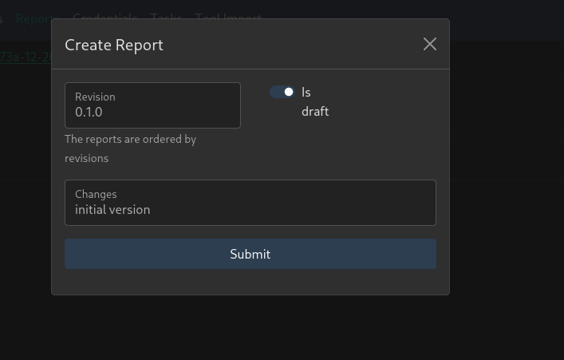

# Reporting
Vulnman can create reports based on the information and vulnerabilities you found during a penetration test.

The report is provided as PDF.

You can [customize](../advanced/customize/report.md) the report template that is used to build the PDF file.

The following types of report templates are currently supported:

- HTML (recommended)

- LaTeX

## Create Report through Web Interface

